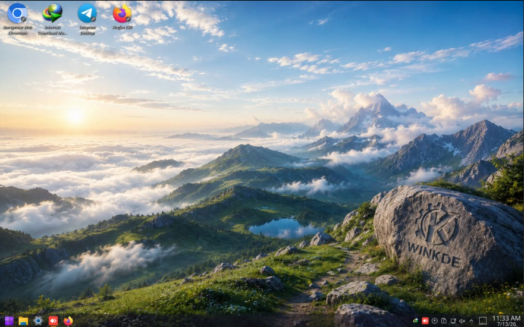
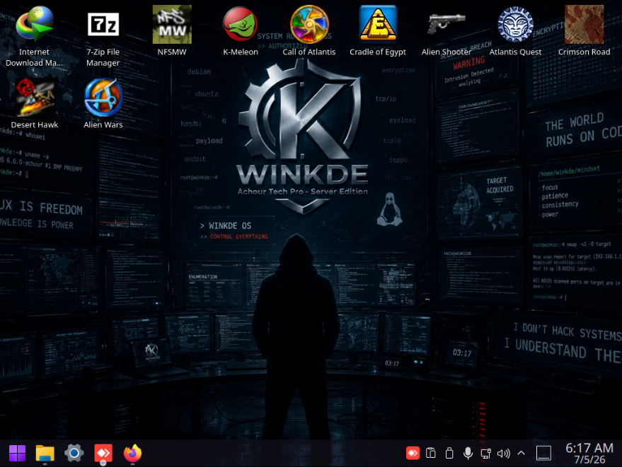

# 🖥️ WinKDE OS - The Algerian Server Edition 🇩🇿

  

**WinKDE OS** is a premium, ultra-optimized, and high-performance Linux distribution proudly engineered from the ground up as a 100% Algerian project. Built on top of the rock-solid and bulletproof foundation of **Debian** and combined with a heavily customized, lightweight **KDE Plasma** desktop environment, this operating system is crafted by **Achour Tech Pro** to deliver maximum speed, absolute stability, and low-resource consumption.

---

## 📦 ISO Information

| Category | Details |
|----------|---------|
| **ISO Size** | ~3.20 GB |
| **Compression** | Advanced XZ algorithms |
| **Architecture** | amd64 (64-bit) |
| **Base Distribution** | Debian 12 Bookworm |
| **Desktop Environment** | KDE Plasma (Heavily Customized) |
| **Boot Mode** | Hybrid (BIOS & UEFI) |
| **Checksum (SHA-256)** | `f71360bc8f7c93e43a6d901bf9eb9d519bfa182f7c006734ef91b72e5071dfca` |

---

## 🖥️ Desktop Previews

  
   
  <em>Desktop 1 - KDE Plasma Interface with Custom Theme</em>

  
   
  <em>Desktop 2 - KDE Plasma Interface with Algerian Landmarks</em>

---

## ⚡ What Can WinKDE OS Do? (Capabilities & Features)

Unlike generic distributions, WinKDE OS is engineered for high-efficiency scenarios, specialized server workloads, and extreme low-level system optimizations:

### 🚀 Run Heavy Workloads on Low-End Hardware
Thanks to extreme memory management, it can run complex environments, background services, and development micro-frameworks smoothly without bloating the system.

### 🖥️ Deploy Rock-Solid Server Environments
Inheriting Debian's stable core, it is fully capable of hosting web servers, database management, remote desktop sessions, and microservices with absolute maximum uptime and enterprise-grade security.

### 🔄 Seamless Windows Co-existence (Dual Boot)
Equipped with a customized GRUB bootloader that safely manages partitions alongside Windows. You can easily switch between your existing Windows system and WinKDE OS without risking a single byte of your data.

### 🛡️ Future-Proof Base Upgrades
The core architecture is designed to allow seamless transitions to future major versions (such as Debian 13) while strictly protecting and preserving your personal configuration data inside the `/home` partition.

### 🎨 Instant Cinema-Grade Visual Experience
Out of the box, it provides a luxury dark/light workflow theme, fully packed with high-definition custom Algerian landmarks and cinematic wallpapers designed to prevent eye strain during long coding sessions.

### 🪟 Run Windows Applications Seamlessly
Full **Wine 9.0** & **Proton** support allows you to run your favorite Windows applications from **Windows 98** to **Windows 10** with excellent performance and compatibility.

---

## 🛠️ System Requirements (Resource Friendly)

WinKDE OS is stripped of all useless packages (Bloatware) and compressed with advanced XZ algorithms to shrink the ISO, allowing it to fly on legacy hardware.

### 📉 Minimum Requirements

| Component | Requirement |
|-----------|-------------|
| **CPU** | Intel Celeron M / AMD Sempron (64-bit) |
| **RAM** | 648 MB |
| **Storage** | 15 GB of free disk space |
| **Graphics** | Not required (optional) |
| **Boot Mode** | BIOS or UEFI |

### 🚀 Recommended Requirements

| Component | Requirement |
|-----------|-------------|
| **CPU** | Core 2 Duo / Athlon 64 X2+ |
| **RAM** | 2 GB or higher |
| **Storage** | 30 - 60 GB (personal preference) |
| **Graphics** | Optional (Intel HD / AMD Radeon) |
| **Boot Mode** | UEFI (for faster boot) |

---

## 📥 Download & Installation

### 🔗 **Official Website:** [https://achour-417414.web.app](https://achour-417414.web.app)

### Installation Steps:

1. **Download** the WinKDE OS ISO image (~3.20 GB) from the official website.
2. **Verify** the ISO integrity using the SHA-256 checksum: `f71360bc8f7c93e43a6d901bf9eb9d519bfa182f7c006734ef91b72e5071dfca`
3. **Flash** the ISO to a USB flash drive (minimum 4 GB) using tools like **Rufus** or **Ventoy**.
4. **Boot** into your machine via USB, and use the graphical wizard installer to safely install it standalone or side-by-side with your Windows system.
5. **Follow** the on-screen instructions to complete the installation (takes approximately 10-15 minutes).

---

## 📞 Support & Contact

| Method | Details |
|--------|---------|
| **Official Email** | technology1082@gmail.com |
| **Business Email** | achour@pxdmail.net |
| **Viber** | +48 729 758 319 |
| **Website** | [https://achour-417414.web.app](https://achour-417414.web.app) |

---

## 📜 License

This project is open-source and available under the **GNU General Public License v3.0**.

---

**Made with ❤️ in Algeria 🇩🇿 by Achour Djerroud (Achour Tech Pro)**

---

## 🏷️ Keywords (SEO & GitHub Tags)

### العربية (Arabic)

وينكد وينكد أو إس عاشور تك برو نظام تشغيل جزائري اسرع نظام تشغيل جزائري اول نظام تشغيل جزائري اخف نظام تشغيل لينكس واجهة كيدي بلازما نظام تشغيل للاجهزة الضعيفة توزيعة جزائرية احسن توزيعة لينكس نظام تشغيل خفيف تحميل وينكد توزيعة خفيفة

text

### English
winkde winkde os achour tech pro achour djerroud algerian operating system fastest algerian os first algerian os lightest linux os kde plasma os for weak devices best algerian linux distribution lightweight os download winkde

text

### Français (French)
winkde winkde os achour tech pro achour djerroud système d'exploitation algérien le plus rapide système d'exploitation algérien premier système d'exploitation algérien système linux le plus léger kde plasma système pour appareils faibles meilleure distribution linux algérienne système d'exploitation léger télécharger winkde

text

### Deutsch (German)
winkde winkde os achour tech pro achour djerroud algerisches betriebssystem schnellstes algerisches betriebssystem erstes algerisches betriebssystem leichtestes linux-betriebssystem kde plasma betriebssystem für schwache geräte beste algerische linux-distribution leichtes betriebssystem winkde herunterladen

text

### Español (Spanish)
winkde winkde os achour tech pro achour djerroud sistema operativo argelino más rápido sistema operativo argelino primer sistema operativo argelino sistema linux más ligero kde plasma sistema para dispositivos débiles mejor distribución linux argelina sistema operativo ligero descargar winkde

text

### Italiano (Italian)
winkde winkde os achour tech pro achour djerroud sistema operativo algerino più veloce sistema operativo algerino primo sistema operativo algerino sistema linux più leggero kde plasma sistema per dispositivi deboli migliore distribuzione linux algerina sistema operativo leggero scaricare winkde

text

### Türkçe (Turkish)
winkde winkde os achour tech pro achour djerroud c ezayir işletim sistemi en hızlı cezayir işletim sistemi ilk cezayir işletim sistemi en hafif linux işletim sistemi kde plasma zayıf cihazlar için işletim sistemi en iyi cezayir linux dağıtımı hafif işletim sistemi winkde indir

text

### Русский (Russian)
винкде винкде ос ачур тек про ачур джерруд алжирская операционная система самая быстрая алжирская ос первая алжирская ос самая легкая линукс ос kde plasma ос для слабых устройств лучший алжирский дистрибутив линукс легкая операционная система скачать винкде

text

### 中文 (Chinese)
winkde winkde os achour tech pro achour djerroud 阿尔及利亚操作系统 最快的阿尔及利亚操作系统 第一个阿尔及利亚操作系统 最轻的Linux操作系统 KDE Plasma 弱设备操作系统 最佳阿尔及利亚Linux发行版 轻量级操作系统 下载winkde

text

### 日本語 (Japanese)
winkde winkde os achour tech pro achour djerroud アルジェリアのオペレーティングシステム 最速のアルジェリアOS 最初のアルジェリアOS 最も軽いLinux OS KDE Plasma 弱いデバイス向けOS 最高のアルジェリアLinuxディストリビューション 軽量OS winkdeをダウンロード

text

### 한국어 (Korean)
winkde winkde os achour tech pro achour djerroud 알제리 운영 체제 가장 빠른 알제리 OS 최초의 알제리 OS 가장 가벼운 리눅스 OS KDE Plasma 약한 기기용 OS 최고의 알제리 리눅스 배포판 경량 OS winkde 다운로드

text

---

## 📊 Project Statistics

| Category | Details |
|----------|---------|
| **Distribution Name** | WinKDE OS |
| **Version** | 1.0.2 |
| **Edition** | Algerian Server Edition |
| **Base Distribution** | Debian 12 Bookworm |
| **Desktop Environment** | KDE Plasma (Heavily Customized) |
| **Architecture** | amd64 (64-bit) |
| **ISO Size** | ~3.20 GB |
| **SHA-256 Checksum** | `f71360bc8f7c93e43a6d901bf9eb9d519bfa182f7c006734ef91b72e5071dfca` |
| **Minimum RAM** | 648 MB |
| **Recommended RAM** | 2 GB+ |
| **Minimum Storage** | 15 GB |
| **Recommended Storage** | 30-60 GB |
| **Minimum CPU** | Intel Celeron M / AMD Sempron (64-bit) |
| **Recommended CPU** | Core 2 Duo / Athlon 64 X2+ |
| **Windows Compatibility** | Wine 9.0 & Proton |
| **License** | GNU GPL v3.0 |
| **Developer** | Achour Djerroud (Achour Tech Pro) |
| **Country** | Algeria 🇩🇿 |

---

**Made with ❤️ in Algeria 🇩🇿 by Achour Djerroud (Achour Tech Pro)**
